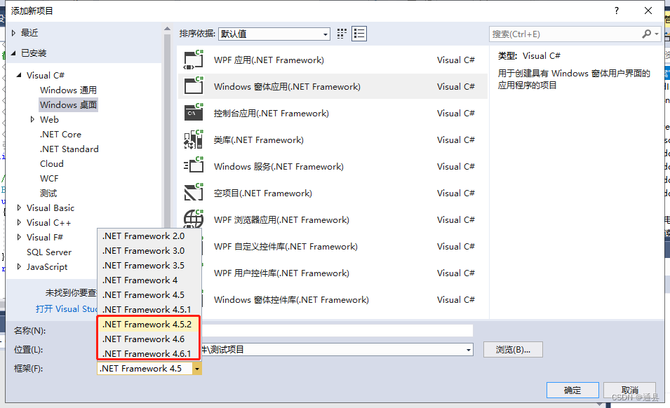
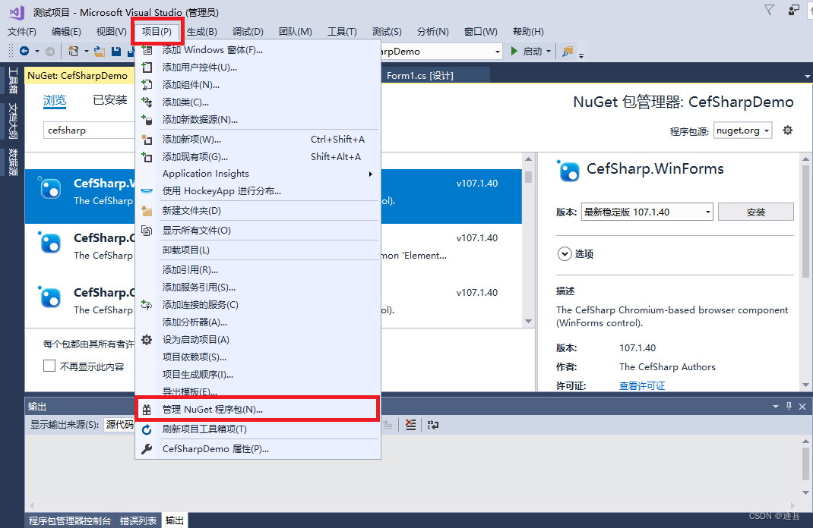
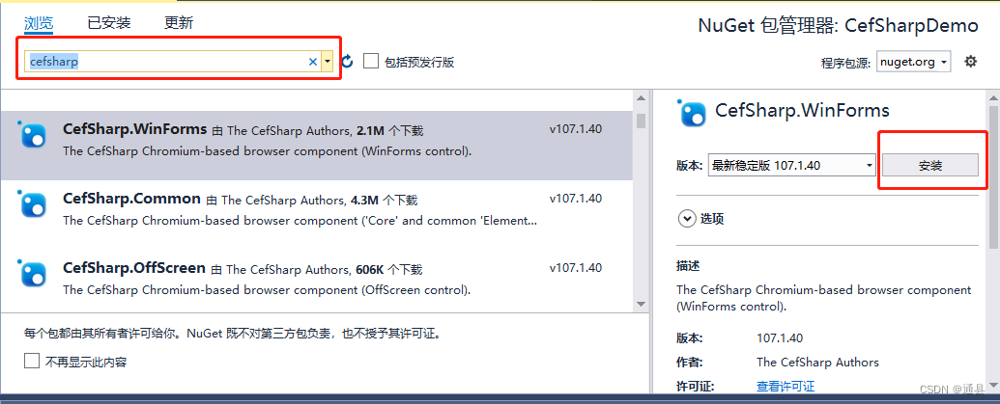
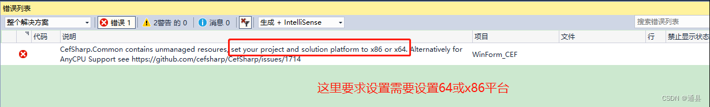
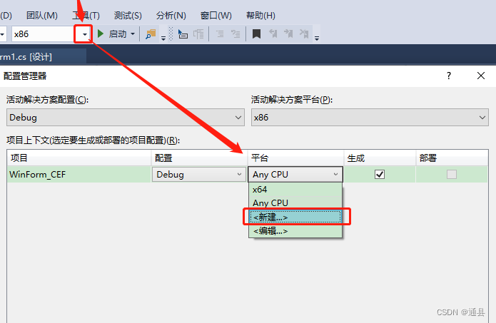

# C# winform使用 CefSharp 简单使用

注意事项写在开头:

- cef要求.Net FrameWork框架最少为4.5.2

- cef不支持anycpu平台

第一步： 新建工程



第二步 添加cef nuget包



第三步：在搜索框输出"cefsharp" ，出现如下结果： 选择红框内包下载




第四步：在窗体load方法内部写入代码

```
private void CefSharpFrm_Load(object sender, EventArgs e)
{
     ChromiumWebBrowser browser;
     // 避免页面加载不出来, 建议加上这句
     Cef.Initialize(new CefSettings());

     browser = new ChromiumWebBrowser("www.baidu.com")
     {
         Dock = DockStyle.Fill
     };
     this.Controls.Add(browser);
 }
```

第五步：F5运行
此时会出现一个错误：因为cefsharp不支持anycpu，所以这里要设置一下，因为x86在64位上也能跑， 反之就不行，一般创建x86平台





重新编译，F5运行


————————————————

版权声明：本文为CSDN博主「通县」的原创文章，遵循CC 4.0 BY-SA版权协议，转载请附上原文出处链接及本声明。

原文链接：https://blog.csdn.net/M735528537/article/details/127673986